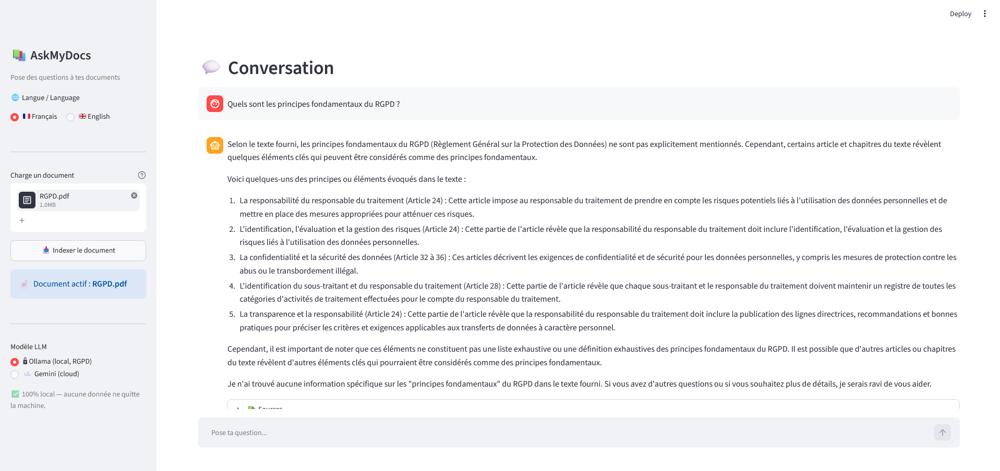
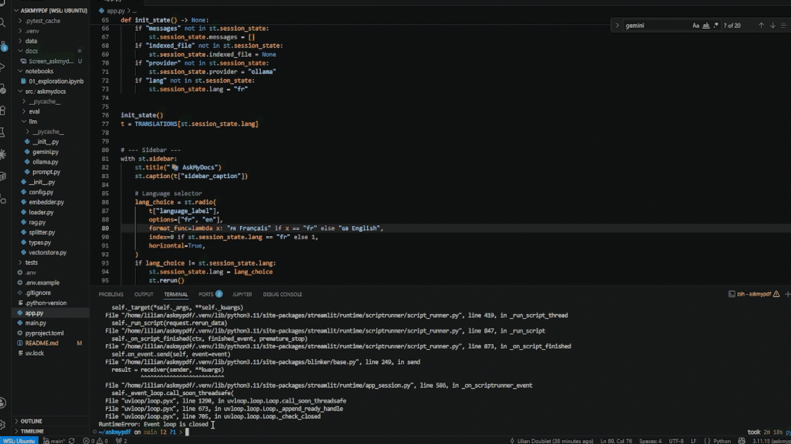
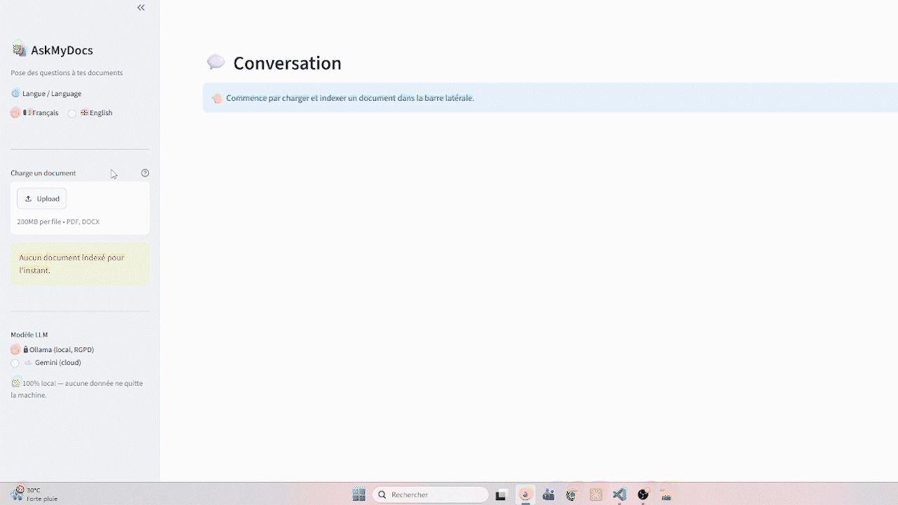
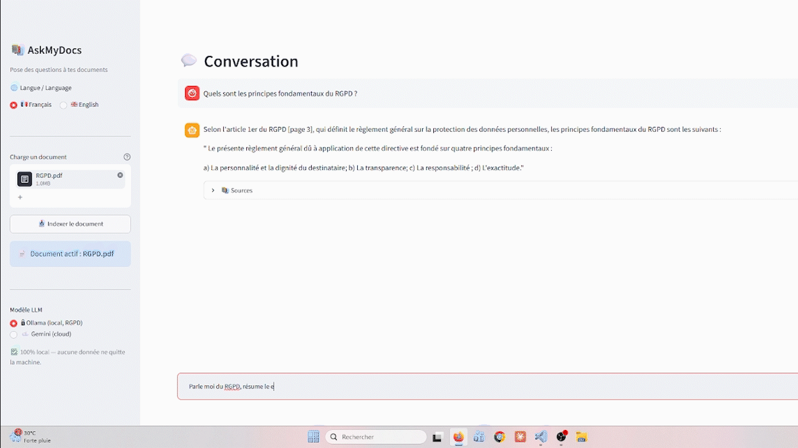
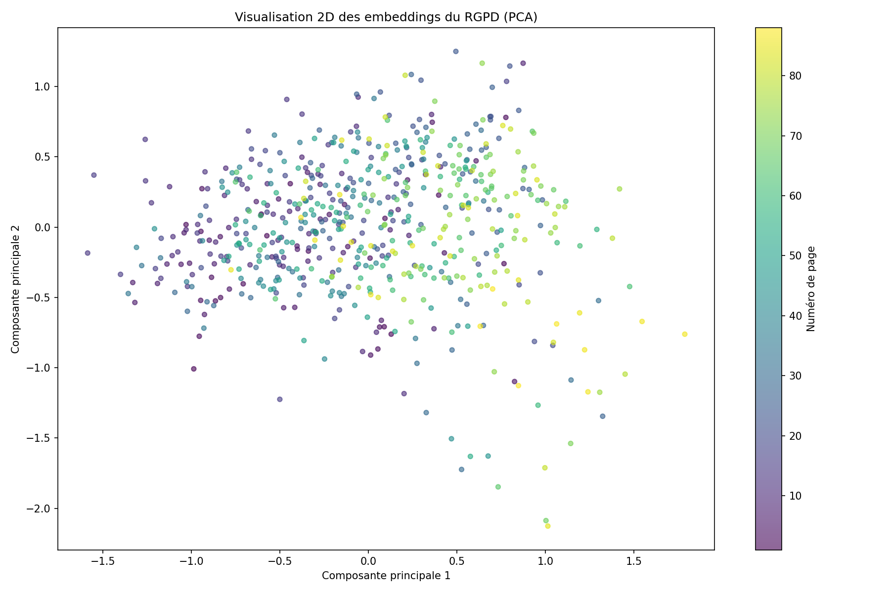

# 📚 AskMyDocs

> Retrieval-Augmented Generation is the backbone of "chat with your documents" systems. This project implements one end to end, **runs fully on-device for privacy**, and **measures whether it actually works**.

A conversational assistant that answers questions about your documents (PDF, Word) through a complete **RAG** pipeline, with source citations and **quantitative evaluation** of answer quality.

Its defining feature is a **dual LLM provider** design: it runs **100% locally** by default (embeddings, vector search *and* generation), so no data ever leaves your machine. This is a privacy-by-design approach well-suited to GDPR-sensitive documents, while a cloud provider (Google Gemini) can be switched on in one click when raw performance matters more than data locality.


<p align="center">
  
</p>

## 🎥 Showcase

<p align="center">
  
</p>

<p align="center">
  
</p>

<p align="center">
  
</p>

## 🎯 Overview

AskMyDocs lets you query a document in natural language. You ask a question, it retrieves the relevant passages from the document and generates a sourced answer, without hallucinating, relying solely on the provided content.

The project implements the full RAG (*Retrieval-Augmented Generation*) chain, from document ingestion to answer generation, **plus** an evaluation harness to objectively measure its performance.

### 🔀 The dual-provider design

The standout feature is that you **choose where inference happens**, directly from the UI:

- 🔒 **Ollama (default, local)** — embeddings, vector search and the LLM all run on your machine. Documents, questions and answers never leave the device. This is the GDPR-compliant mode, and it's the default for a reason: the project's own test document is the GDPR regulation itself.
- ☁️ **Google Gemini (optional, cloud)** — a more powerful model for when answer quality matters more than data locality. A clear in-app warning reminds you that data is sent to a third party.

This isn't a hidden config flag: the trade-off between **confidentiality** and **performance** is surfaced to the user as an explicit, conscious choice — *privacy by design* in practice.

Architecturally, both providers sit behind a **single interface**. Swapping between them touches **one module only** (`src/askmydocs/llm/`); the rest of the pipeline is completely unaware of which backend answered. This loose coupling is the design decision I'm most proud of in this project.

## ✨ Features

- 📄 Ingestion of **PDF** and **Word** (.docx) documents
- ✂️ Smart chunking with metadata preservation (source, page)
- 🔍 Semantic search via multilingual embeddings (optimized for French)
- 🔀 **Dual LLM provider** with one-click switching: Ollama (local, GDPR) or Gemini (cloud, performance)
- 🔒 **100% local generation** by default — no data leaves the machine
- 🤖 Answers strictly grounded in the retrieved context (no hallucination)
- 📌 **Source citations** (document + page) for every answer
- 💬 Chat interface with history (Streamlit)
- 📊 **Evaluation harness**: annotated dataset, retrieval and generation metrics

## 💬 Example

**Q:** "What is the deadline to notify a personal data breach?"

**A:** Under Article 33 of the GDPR, a personal data breach must be notified to the supervisory authority without undue delay and, where feasible, no later than **72 hours** after becoming aware of it [page 17].

> 📄 Sources: RGPD.pdf, p.17

## 🏗️ Architecture

```
PDF / DOCX
    │
    ▼
  Loader  ──────►  Splitter  ──────►  Embedder  ──────►  ChromaDB
(extraction)     (chunking)      (vectorization)    (vector storage)
                                                            │
                                                            ▼
                              Question ──► Semantic search (top-K)
                                                            │
                                                            ▼
                                  Generation via provider interface
                                       ┌──────────┴──────────┐
                                       ▼                     ▼
                               Ollama (local, GDPR)   Gemini (cloud)
                                       └──────────┬──────────┘
                                                  ▼
                                      Answer + cited sources
```

The pipeline is exposed through two high-level functions in `rag.py`:
- `ingest(file_path)`: loads, chunks and indexes a document
- `ask(question, provider=...)`: retrieves the relevant passages and generates the answer with the chosen provider

The layered design keeps the LLM provider behind a single interface: switching between Ollama and Gemini only touches one module, the rest of the pipeline is untouched.

## 🛠️ Tech Stack

| Layer | Tool | Why this choice |
|---|---|---|
| Language | Python 3.11+ | Standard for ML/data work |
| Dependency management | uv | Fast, modern, reproducible locks |
| PDF / DOCX extraction | pypdf, python-docx | Lightweight, no system deps |
| Chunking | langchain-text-splitters | Robust recursive splitting |
| Embeddings | sentence-transformers (`paraphrase-multilingual-MiniLM-L12-v2`) | Local, free, multilingual (French) |
| Vector store | ChromaDB | Zero-config local persistence |
| LLM (default) | Ollama (`llama3.2`), local | 100% on-device, no data leaves the machine (GDPR) |
| LLM (optional) | Google Gemini | Cloud alternative when performance matters more than locality |
| UI | Streamlit | Fast Python-native UI |
| Evaluation | custom annotated dataset + custom metrics | Full control over what's measured |
| Tests | pytest | Coverage of core logic and edge cases |

> 💡 The local model is configurable in one line (`OLLAMA_MODEL` in `config.py`). `llama3.2` is the default; switching to `mistral` improves French-language output at the cost of more RAM — exactly the kind of swap the loose-coupling design makes trivial.

## ⚙️ Requirements

- **Python 3.11+** and [uv](https://docs.astral.sh/uv/)
- **~6 GB of RAM** to run a local 7B model (e.g. `mistral`) comfortably alongside the embedding model. Lighter models such as `llama3.2` (3B) work on less. On WSL, allocate memory explicitly in `.wslconfig` to avoid out-of-memory kills.
- *(Optional)* a Google AI Studio API key, only if you want to use the Gemini provider.

## 🚀 Installation

```bash
# Clone the repository
git clone https://github.com/liliandoublet/askmydocs.git
cd askmydocs

# Install dependencies with uv
uv sync
```

### Default: local LLM with Ollama (recommended)

```bash
# Install Ollama (macOS / Linux)
curl -fsSL https://ollama.com/install.sh | sh

# Pull a model
ollama pull llama3.2

# Make sure the Ollama server is running (it listens on localhost:11434)
ollama serve
```

No API key is required, everything runs locally.

### Optional: cloud LLM with Gemini

```bash
cp .env.example .env
# Edit .env and add your Google AI Studio key
```

Get a free API key from [Google AI Studio](https://aistudio.google.com/apikey).

## 💻 Usage

### Run the application

```bash
uv run streamlit run app.py
```

Upload a document in the sidebar, index it, pick your provider (Ollama or Gemini) in the sidebar, then ask your questions.

### Command line

```bash
# Run the full pipeline on a document
uv run python -m askmydocs.rag data/uploads/my_document.pdf "My question?"
```

## 📊 Evaluation

The project includes an evaluation harness that measures the pipeline's performance on a dataset of annotated questions (with reference pages and expected keywords).

```bash
uv run python -m askmydocs.eval.runner data/uploads/RGPD.pdf
```

### Metrics measured

The harness **decouples retrieval from generation**, to precisely diagnose the source of any failure: a low hit rate points to a retrieval problem, while a good hit rate paired with refusals points to a prompt or generation problem.

| Metric | What it measures |
|---|---|
| **Hit rate** | Does retrieval find at least one relevant page? |
| **Precision** | What proportion of retrieved chunks is relevant? |
| **Keyword recall** | Does the generated answer contain the expected facts? |
| **Refusal rate** | How often the LLM responds "I can't find this" |

### Results on the GDPR document (88 pages, 626 chunks)

Because the two providers share the exact same retrieval pipeline, retrieval metrics (hit rate, precision) are identical across them — only the generation metrics (keyword recall, refusal rate) reflect the model. The table below reports both so the comparison stays honest.

| Metric | Ollama (`llama3.2`, local) | Gemini (cloud) |
|---|---|---|
| Hit rate | 50.0% | _TBD_ |
| Precision | 11.7% | _TBD_ |
| Keyword recall | 58.3% | _TBD_ |
| Refusal rate | 2/10 | _TBD_ |

> **Reading the numbers:** precision is expected to be low on this corpus. With
> only 1 to 2 relevant pages out of 88, even perfect retrieval cannot score high.
> The meaningful signals here are **hit rate** (is the right page found?) and
> **keyword recall** (is the answer factually correct?).

> **The local trade-off, measured honestly:** running fully on-device is not free.
> A small local model is slower (tens of seconds per answer on CPU) and produces
> rougher French than a frontier cloud model. The dual-provider design exists
> precisely to make that trade-off a deliberate choice rather than a hidden cost —
> privacy by default, performance on demand.

## 🧠 Engineering notes

A few real problems solved while building this, and what they taught me:

- **Embedding model / language mismatch**: the initial English-centric model
  poorly separated French text (a discriminative gap of only ~0.08 between related
  and unrelated sentence pairs). Diagnosing this and switching to a multilingual
  model more than doubled the gap. Lesson: match the embedding model to the
  language of your corpus, and *measure* it rather than assume.
- **Extraction noise leading to index pollution**: figure-heavy pages produced
  1-character chunks (bare page numbers) that polluted the vector index and
  surfaced as irrelevant top results. Added a minimum-length filter, covered by a
  unit test. Lesson: in RAG, ingestion quality matters as much as the model.
  *Garbage in, garbage out.*
- **External API resilience**: the cloud LLM API intermittently returned 429 (rate
  limit) and 503 (overload) responses during batch evaluation. Added
  retry-with-backoff covering both, plus graceful degradation so a single failure
  doesn't discard the whole run. This also motivated the dual-provider design: the
  local Ollama backend removes the external dependency entirely.
- **Loose coupling that paid off**: the original project ran only on Gemini.
  Adding a fully local provider meant writing one new module behind a shared
  `generate_answer` interface — `rag.py`, the UI and the eval harness were never
  touched. When an architecture decision lets you swap a core component by adding
  a single file, you know the seams are in the right place.
- **Operational constraints are real**: running a 7B model locally exposed hard
  RAM limits (OOM kills under WSL's default memory allocation). Diagnosing it with
  `free -h` and raising the WSL memory/swap budget fixed it. Local inference isn't
  just a code decision — it's a resource-management one.

## 🔬 Embedding visualization

The notebook `notebooks/01_exploration.ipynb` projects the corpus embedding space into 2D (PCA). It shows the thematic clustering of chunks and the position of a query among the relevant passages.



## 📁 Project structure

```
askmydocs/
├── src/askmydocs/
│   ├── config.py          # Centralized configuration
│   ├── types.py           # Shared types (TypedDict)
│   ├── loader.py          # PDF / DOCX extraction
│   ├── splitter.py        # Chunking
│   ├── embedder.py        # Embedding generation
│   ├── vectorstore.py     # Storage and search (ChromaDB)
│   ├── rag.py             # Pipeline orchestration
│   ├── llm/               # Answer generation (provider interface)
│   │   ├── __init__.py    # Provider selector (routes to ollama / gemini)
│   │   ├── ollama.py      # Local LLM (default, privacy / GDPR)
│   │   ├── gemini.py      # Cloud LLM (optional, performance)
│   │   └── prompt.py      # Shared system prompt used by both providers
│   └── eval/              # Evaluation harness
│       ├── metrics.py
│       └── runner.py
├── notebooks/             # Exploration and visualization
├── tests/                 # Unit tests (pytest)
├── data/                  # Documents and evaluation dataset
└── app.py                 # Streamlit interface
```

## 🧪 Tests

```bash
uv run pytest -v
```

## 🔭 Possible improvements

- Benchmark Gemini against Ollama on the full evaluation set (table above)
- Try `mistral` as the local model for better French output
- Result re-ranking with a cross-encoder
- Hybrid search (semantic + keyword / BM25)
- Expand the evaluation dataset
- OCR support for scanned PDFs

## 📄 License

This project is licensed under the MIT License, see the [LICENSE](LICENSE) file for details.
